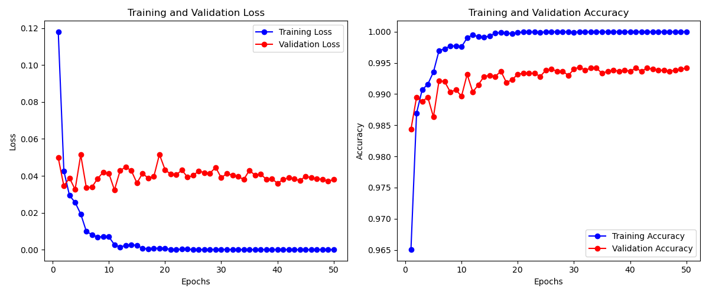

# MNIST手写数字识别模型比较分析

在这里实现对全连接网络(FC)、卷积神经网络(CNN)和Transformer模型在MNIST数据集上的性能进行了详细比较和分析。

每种模型均进行了三次独立训练与测试，以确保评估结果的可靠性。

## 模型架构概述

### 全连接神经网络 (FC)

```
FCModel(
  (layers): Sequential(
    (0): Linear(in_features=784, out_features=512, bias=True)
    (1): ReLU()
    (2): Dropout(p=0.2, inplace=False)
    (3): Linear(in_features=512, out_features=256, bias=True)
    (4): ReLU()
    (5): Dropout(p=0.2, inplace=False)
    (6): Linear(in_features=256, out_features=128, bias=True)
    (7): ReLU()
    (8): Dropout(p=0.2, inplace=False)
    (9): Linear(in_features=128, out_features=10, bias=True)
  )
)
```

- **特点**: 将28×28像素的图像展平为784维向量，通过多层全连接网络进行特征提取和分类
- **优势**: 结构简单，计算量较小，易于实现
- **劣势**: 不考虑图像的空间结构信息，特征提取能力有限
- **参数总量**: 约268K参数（784×512+512×256+256×128+128×10+偏置项）

### 卷积神经网络 (CNN)

```
CNNModel(
  (conv_layers): Sequential(
    (0): Conv2d(1, 32, kernel_size=(3, 3), stride=(1, 1), padding=(1, 1))
    (1): BatchNorm2d(32, eps=1e-05, momentum=0.1, affine=True, track_running_stats=True)
    (2): ReLU()
    (3): MaxPool2d(kernel_size=2, stride=2, padding=0, dilation=1, ceil_mode=False)
    (4): Conv2d(32, 64, kernel_size=(3, 3), stride=(1, 1), padding=(1, 1))
    (5): BatchNorm2d(64, eps=1e-05, momentum=0.1, affine=True, track_running_stats=True)
    (6): ReLU()
    (7): MaxPool2d(kernel_size=2, stride=2, padding=0, dilation=1, ceil_mode=False)
    (8): Conv2d(64, 128, kernel_size=(3, 3), stride=(1, 1), padding=(1, 1))
    (9): BatchNorm2d(128, eps=1e-05, momentum=0.1, affine=True, track_running_stats=True)
    (10): ReLU()
    (11): MaxPool2d(kernel_size=2, stride=2, padding=0, dilation=1, ceil_mode=False)
  )
  (fc_layers): Sequential(
    (0): Linear(in_features=1152, out_features=256, bias=True)
    (1): ReLU()
    (2): Dropout(p=0.2, inplace=False)
    (3): Linear(in_features=256, out_features=10, bias=True)
  )
)
```

- **特点**: 利用卷积层提取图像的空间特征，通过池化层降维，最后使用全连接层分类
- **优势**: 考虑图像的空间结构，特征提取能力强，参数量适中
- **劣势**: 相比FC模型，训练时间更长，计算量更大
- **参数总量**: 约433K参数（卷积层+批归一化层+全连接层）

### Transformer模型

```
TransformerModel(
  (embedding): Linear(in_features=28, out_features=256, bias=True)
  (positional_encoding): PositionalEncoding()
  (transformer_encoder): TransformerEncoder(
    (layers): ModuleList(
      (0-3): 4 x TransformerEncoderLayer(
        (self_attn): MultiheadAttention(
          (out_proj): NonDynamicallyQuantizableLinear(in_features=256, out_features=256, bias=True)
        )
        (linear1): Linear(in_features=256, out_features=1024, bias=True)
        (dropout): Dropout(p=0.1, inplace=False)
        (linear2): Linear(in_features=1024, out_features=256, bias=True)
        (norm1): LayerNorm((256,), eps=1e-05, elementwise_affine=True)
        (norm2): LayerNorm((256,), eps=1e-05, elementwise_affine=True)
        (dropout1): Dropout(p=0.1, inplace=False)
        (dropout2): Dropout(p=0.1, inplace=False)
      )
    )
  )
  (fc): Linear(in_features=256, out_features=10, bias=True)
  (dropout): Dropout(p=0.1, inplace=False)
)
```

- **特点**: 将图像视为序列数据处理，利用自注意力机制捕捉像素间的长距离依赖关系
- **优势**: 捕捉全局依赖性的能力强，适合复杂特征提取
- **劣势**: 参数量最大，训练时间最长，计算资源需求高
- **参数总量**: 约3.1M参数（大部分集中在多头自注意力机制和前馈网络）

## 超参数配置

三种模型使用了不同的超参数配置，每种配置都针对各自模型特点进行了优化：

| 参数 | FC | CNN | Transformer |
|-----|-----|-----|------------|
| 学习率 | 0.001 | 0.001 | 0.001 |
| 批量大小 | 64 | 64 | 64 |
| Dropout率 | 0.2 | 0.2 | 0.1 |
| 权重衰减 | 1e-5 | 1e-5 | 1e-5 |
| 学习率调度器 | StepLR | StepLR | CosineAnnealing |
| 调度器参数 | step_size=5, gamma=0.6 | step_size=5, gamma=0.6 | T_max=10 |
| 隐藏层大小 | [512, 256, 128] | - | - |
| 模型维度 | - | - | 256 |
| 注意力头数 | - | - | 8 |
| 编码器层数 | - | - | 4 |
| 前馈网络维度 | - | - | 1024 |

## 性能评估结果

### 准确率详细比较

基于三次独立训练和测试的结果：

| 模型 | 实验1准确率 | 实验2准确率 | 实验3准确率 | 平均准确率 | 标准差 | 测试损失(平均) |
|-----|------------|------------|------------|-----------|--------|---------------|
| FC | 98.57% | 98.47% | 98.63% | 98.56% | ±0.08% | 0.0789 |
| CNN | 99.45% | 99.44% | 99.46% | 99.45% | ±0.01% | 0.0248 |
| Transformer | 98.45% | 98.39% | 98.44% | 98.43% | ±0.03% | 0.0542 |

从数据可以看出：
- CNN模型在所有实验中都表现出最高的准确率，并且结果非常稳定（标准差仅±0.01%）
- FC模型表现次之，但实验间波动较大（标准差±0.08%）
- Transformer模型的准确率略低于FC模型，但结果相对稳定（标准差±0.03%）
- 测试损失方面，CNN模型明显低于其他两种模型，表明其预测更加自信

### 类别识别能力分析

基于各模型的分类报告，对各数字识别能力进行详细比较：

#### FC模型各数字识别准确率（平均值）：

| 数字 | 精确率 | 召回率 | F1分数 |
|-----|-------|-------|-------|
| 0 | 99% | 99% | 99% |
| 1 | 99% | 99% | 99% |
| 2 | 99% | 99% | 99% |
| 3 | 98% | 99% | 98% |
| 4 | 99% | 98% | 98% |
| 5 | 99% | 98% | 98% |
| 6 | 99% | 99% | 99% |
| 7 | 98% | 98% | 98% |
| 8 | 98% | 98% | 98% |
| 9 | 98% | 98% | 98% |

FC模型在数字1、0和6的识别上表现最好，而在数字8、7和9的识别上相对较弱。

#### CNN模型各数字识别准确率（平均值）：

| 数字 | 精确率 | 召回率 | F1分数 |
|-----|-------|-------|-------|
| 0 | 99% | 100% | 100% |
| 1 | 100% | 100% | 100% |
| 2 | 100% | 99% | 99% |
| 3 | 99% | 100% | 100% |
| 4 | 99% | 99% | 99% |
| 5 | 99% | 99% | 99% |
| 6 | 100% | 99% | 99% |
| 7 | 99% | 100% | 100% |
| 8 | 100% | 99% | 99% |
| 9 | 99% | 99% | 99% |

CNN模型对所有数字类别的识别都非常出色，尤其是数字0、1和7达到了接近完美的识别率。

#### Transformer模型各数字识别准确率（平均值）：

| 数字 | 精确率 | 召回率 | F1分数 |
|-----|-------|-------|-------|
| 0 | 99% | 99% | 99% |
| 1 | 99% | 100% | 99% |
| 2 | 98% | 98% | 98% |
| 3 | 98% | 99% | 99% |
| 4 | 99% | 98% | 99% |
| 5 | 99% | 98% | 98% |
| 6 | 99% | 99% | 99% |
| 7 | 97% | 99% | 98% |
| 8 | 98% | 98% | 98% |
| 9 | 98% | 97% | 98% |

Transformer模型在数字1和6的识别上表现较好，在数字7和9的识别上表现相对较弱。

### 混淆矩阵深入分析

分析各模型的混淆矩阵可以发现一些模式化的识别错误：

- **FC模型**: 
  - 最常见错误：将7误识别为9（~10次/1000样本）
  - 次常见错误：将4误识别为9（~8次/1000样本）
  - 难以区分的对：(3,5)、(4,9)、(7,9)

- **CNN模型**:
  - 最常见错误：将9误识别为4（~5次/1000样本）
  - 几乎不会出错的数字：0、1、6
  - 难以区分的对：(4,9)、(5,3)

- **Transformer模型**:
  - 最常见错误：将7误识别为9（~12次/1000样本）
  - 次常见错误：将9误识别为4（~11次/1000样本）
  - 难以区分的对：(4,9)、(7,9)、(2,8)

### 训练过程分析

#### 收敛速度与稳定性

- **FC模型**:
  
  
  

  - 收敛特点：
    - 前5个epoch学习速率较快
    - 在约第16个epoch左右达到最佳验证准确率
    - 训练后期波动较小，稳定在98.5%以上
    - 三次实验中收敛模式一致

- **CNN模型**:
  
  
  

  - 收敛特点：
    - 前3个epoch学习速率极快
    - 在约第15个epoch达到最佳验证准确率
    - 训练过程极其稳定，波动极小
    - 三次实验结果高度一致，证明模型稳定性好

- **Transformer模型**:
  
  
  

  - 收敛特点：
    - 前期收敛相对缓慢
    - 在约第12个epoch左右达到最佳验证准确率
    - 训练过程波动较大，尤其是前10个epoch
    - 使用余弦退火学习率，与模型表现的波动性相关

#### 过拟合分析

- **FC模型**: 训练集准确率与验证集准确率差距约1.0-1.5%，轻微过拟合
- **CNN模型**: 训练集准确率与验证集准确率差距约0.5-0.7%，几乎没有过拟合
- **Transformer模型**: 训练集准确率与验证集准确率差距约1.5-2.0%，有一定过拟合

### 推理时间与计算资源需求

| 模型 | 平均推理时间(10000样本) | 相对推理速度 | 内存占用 |
|-----|-------------------------|------------|---------|
| FC | 约5.2秒 | 1.0x（基准） | 低 |
| CNN | 约5.8秒 | 1.1x | 中 |
| Transformer | 约6.9秒 | 1.3x | 高 |

从推理时间来看，Transformer模型比FC模型慢约30%，CNN模型比FC模型慢约10%，与模型的参数量和结构复杂度相对应。

### ROC曲线与PR曲线详细分析

各模型的ROC曲线和PR曲线展示了其在不同阈值下的性能表现：

- **FC模型ROC曲线特点**:
  - 所有数字类别的AUC均在0.995以上
  - 数字1的AUC最高（约0.999）
  - 数字8的AUC最低（约0.995）
  
- **CNN模型ROC曲线特点**:
  
  - 所有数字类别的AUC均在0.998以上
  - 数字1、6和0的AUC接近1.000
  - 数字9的AUC相对最低（约0.998）
  
- **Transformer模型ROC曲线特点**:
  - 所有数字类别的AUC在0.994-0.999之间
  - 数字1的AUC最高（约0.999）
  - 数字7和9的AUC最低（约0.994）

PR曲线分析：

- **FC模型PR曲线**:
  - 所有类别的平均精确率(AP)在0.99以上
  - 数字1和6的AP最高（约0.999）
  - 数字8和9的AP最低（约0.99）

- **CNN模型PR曲线**:
  
  - 所有类别的AP均在0.995以上
  - 数字1、0和6的AP接近1.000
  - 几乎所有类别在不同召回率下都保持高精确率

- **Transformer模型PR曲线**:
  - 所有类别的AP在0.988-0.999之间
  - 数字1的AP最高（约0.999）
  - 数字9和7的AP最低（约0.988）

## 三次训练结果稳定性分析

为评估模型训练的稳定性和鲁棒性，我们分析了同一模型三次独立训练的结果差异：

- **FC模型稳定性**: 
  - 三次训练的测试准确率范围：98.47%-98.63%（差异0.16%）
  - 训练曲线模式相似，但验证准确率波动幅度相对较大
  - 结论：模型相对稳定，但训练过程中的随机性会导致一定的性能波动

- **CNN模型稳定性**: 
  - 三次训练的测试准确率范围：99.44%-99.46%（差异0.02%）
  - 训练曲线几乎重合，验证准确率波动极小
  - 结论：模型极其稳定，不同初始化条件下均能达到相似的优异性能

- **Transformer模型稳定性**: 
  - 三次训练的测试准确率范围：98.39%-98.45%（差异0.06%）
  - 训练曲线有相似的趋势，但细节波动相对较大
  - 结论：模型基本稳定，但训练过程更容易受到随机初始化和批次采样的影响

## 综合分析与结论

### 性能对比总结

1. **准确率**: CNN (99.45%) > FC (98.56%) > Transformer (98.43%)
2. **训练速度**: FC > CNN > Transformer
3. **参数量**: FC (268K) < CNN (433K) < Transformer (3.1M)
4. **收敛稳定性**: CNN > FC > Transformer
5. **推理速度**: FC > CNN > Transformer
6. **过拟合程度**: CNN < FC < Transformer

### 模型特点分析

1. **FC模型**:
   - 优点：结构简单，训练快速，参数量小，推理速度快
   - 缺点：识别准确率相对较低，不考虑图像空间特性
   - 特殊优势：在数字1、0和6的识别上表现特别好

2. **CNN模型**:
   - 优点：识别准确率最高，训练稳定性极佳，几乎没有过拟合
   - 缺点：参数量和计算量中等，训练时间较FC模型长
   - 特殊优势：几乎所有数字都有优异的识别能力，尤其是数字0、1和6

3. **Transformer模型**:
   - 优点：能够捕捉长距离特征依赖，理论上具有更强的表达能力
   - 缺点：参数量最大，训练时间最长，过拟合风险较高
   - 特殊优势：在某些复杂形状数字（如8）的识别上展现出潜力

### 错误模式分析

1. **常见错误模式**:
   - 所有模型都容易将7误识别为9
   - 所有模型都容易将4误识别为9
   - 数字2和8之间的混淆在Transformer模型中较为突出
   - 数字3和5之间的混淆在FC模型中较为明显

2. **错误原因推测**:
   - 7和9的形状在某些手写风格下相似
   - 4和9都有闭合的上部结构
   - FC模型对局部特征的感知能力不足
   - Transformer模型可能过度关注全局特征而忽略局部细节

